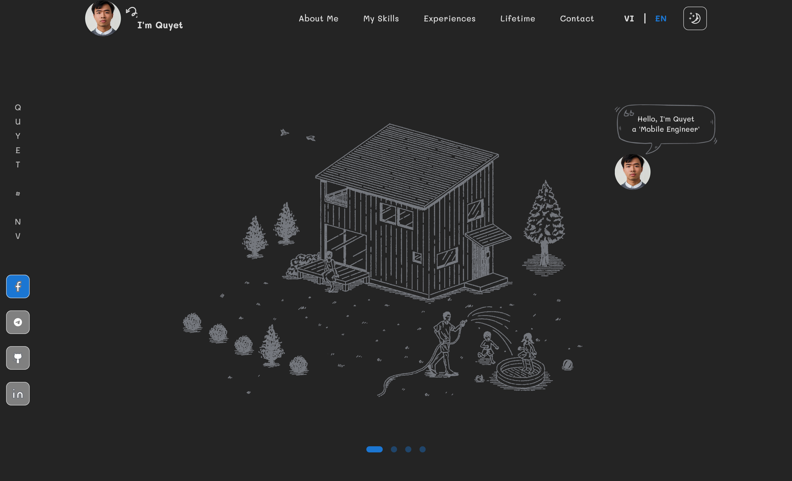
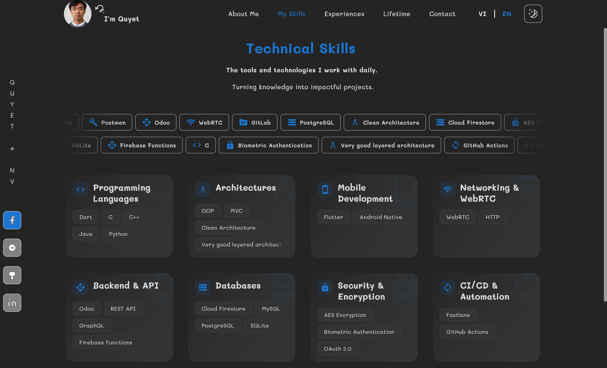
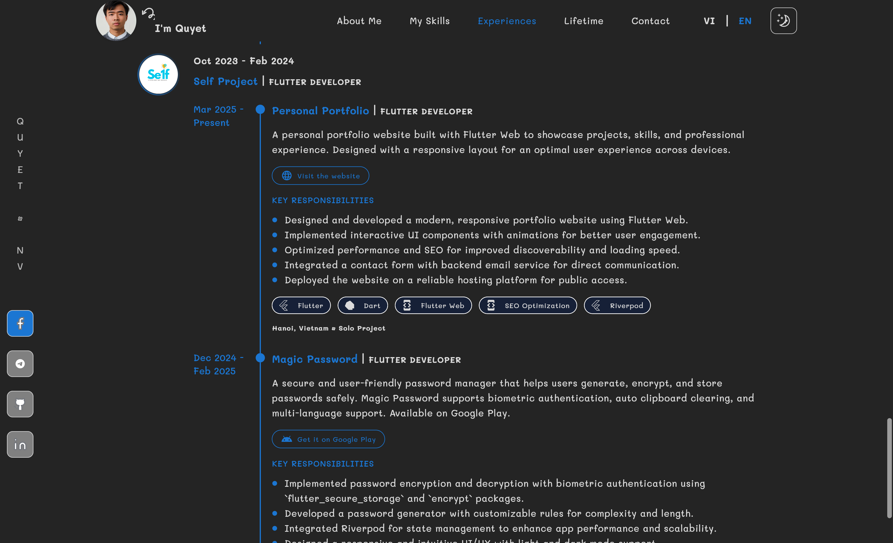

# 🚀 Portfolio Website

<div align="center">
  
   

**A personal portfolio website built with Flutter Web**

[View Demo](http://quyetnv.pantech.vn/) • [Report Bug](https://github.com/quyetnv-mlhn/portfolio/issues) • [Request Feature](https://github.com/quyetnv-mlhn/portfolio/issues)

</div>

## 📋 Overview

A personal portfolio designed to showcase my professional journey, skills, and projects. Built entirely with **Flutter Web**, the website is optimized for all modern browsers and provides an engaging user experience across all devices.

<div align="center">

| Home Screen | Skills Screen | Experiences Screen |
| :------------------------------------------------------------------------------------: | :--------------------------------------------------------------------------------------: | :--------------------------------------------------------------------------------------------: |
|  |  |  |

</div>

## ✨ Features

<table>
  <tr>
    <td width="50%">
      <ul>
        <li>🔄 <b>Responsive</b> UI for all screen sizes</li>
        <li>🌓 <b>Light/Dark theme</b> toggle</li>
        <li>🌐 <b>Bilingual</b> support (English & Vietnamese)</li>
        <li>✨ <b>Interactive animations</b> (UI and text effects)</li>
      </ul>
    </td>
    <td width="50%">
      <ul>
        <li>📂 Detailed <b>project showcase</b> with descriptions and links</li>
        <li>🛠️ <b>Skills</b> and <b>tech stack</b> overview</li>
        <li>📱 <b>Professional contact</b> information and social media links</li>
        <li>🎨 Clean, modern <b>UI design</b> with intuitive navigation</li>
      </ul>
    </td>
  </tr>
</table>

## 🛠️ Tech Stack

<div align="center">

| Technology | Description |
|:---:|:---|
| **Flutter Web** | Cross-platform UI framework |
| **Riverpod** | Efficient state management |
| **Go Router** | Flexible routing |
| **Easy Localization** | Multilingual support |
| **Animated Text Kit** | Dynamic text effects |
| **Flutter Flavors** | Environment management |
| **Build Runner & Flutter Gen** | Code generation |
| **URL Launcher** | External link handling |

</div>

## 🚀 Getting Started

### Prerequisites

- **Flutter SDK** (latest)
- **Dart SDK** (latest)
- **Git**
- **Chrome** (recommended for development)

### Installation

Clone the repository and set up the environment:

```bash
git clone https://github.com/quyetnv-mlhn/portfolio
cd portfolio
flutter pub get
```

### Environment Setup

Copy the environment templates and adjust variables:

```bash
cp assets/env/.env.template assets/env/.env.dev
cp assets/env/.env.template assets/env/.env.stg
cp assets/env/.env.template assets/env/.env.prod
```

> ⚠️ **Important:** You **must** set the `FORMSPREE_ENDPOINT` variable in each `.env` file.  
> Without this, the contact form will **not** work.

### Code Generation & Localization

```bash
flutter clean
flutter pub get
flutter pub run build_runner build --delete-conflicting-outputs
dart run easy_localization:generate -S assets/translations -O lib/gen
dart run easy_localization:generate -S assets/translations -s en-US.json -O lib/gen -o locale_keys.g.dart -f keys
dart fix --apply
dart format .
```

### Running the App

To run on **Chrome**:

```bash
flutter run -d chrome
```

## 📝 Personal Information Update

To customize personal information (e.g., profile, skills, experiences, etc.), update the data files located in:

```
assets/data/
```

> **⚠️ Do not rename or remove any existing keys** in the model.  
> If you want to **add a new item**, make sure it contains **all required keys** of the corresponding model.

## 🧪 Testing

To run unit tests:

```bash
flutter test
```

## 🏗️ Build

To build the web version:

```bash
flutter build web --release --base-href / -t lib/flavors/main_dev.dart canvaskit
```

## 📂 Project Structure

```
lib/
├── app/                 # App entry point and provider observer
├── core/                # Core utilities, constants, enums
│   ├── constants/       # App constants
│   ├── enums/           # Enums for different use cases
│   ├── utils/           # Utility functions
│   ├── exceptions/      # Custom exceptions
│   ├── extensions/      # Extensions on existing classes
│   └── configs/         # App configuration files (sizes, colors, etc.)
├── data/                # Data layer: repositories and services
│   ├── repositories/    # Repository implementations
│   └── services/        # External services
├── domain/              # Domain layer: business models and repository contracts
├── flavors/             # Flavor-specific files (production, staging, dev)
├── gen/                 # Generated code (assets, localization)
└── ui/                  # User Interface
    ├── routes/          # Routing and navigation setup
    ├── shared/          # Shared components: themes, widgets, transitions
    └── views/           # Feature-based views
        ├── experience/  # Feature: experience view models, models, views
        ├── base_screen/ # Base screen layout, navigation
        ├── home/        # Home screen related files
        ├── contact/     # Contact form and related files
        ├── about_me/    # About me section components
        └── skills/      # Skills section components
```

## 🤝 Contributing

Contributions are **welcome**! If you'd like to help improve or enhance this project, please follow these steps:

1. **Fork** the repository
2. Create a new **branch** (`git checkout -b feature-name`)
3. Make your changes
4. **Commit** your changes (`git commit -am 'Add new feature'`)
5. Push your changes (`git push origin feature-name`)
6. Open a **pull request** with a clear description of what you've done

### Issues and Feature Requests

Feel free to **open an issue** for any bugs, feature requests, or suggestions. I encourage the community to help by reporting problems or suggesting new features.

### Roadmap

- **Current Focus:**
  - Improve accessibility and performance
  - Expand features in the project showcase section
  - Enhance internationalization (add more languages)

- **Future Plans:**
  - Implement more interactive and dynamic components
  - Optimize the website for SEO and better discoverability
  - Add a blog or blog-like feature to share thoughts and tutorials

Check the **[Issues](https://github.com/quyetnv-mlhn/portfolio/issues)** and **[Projects](https://github.com/quyetnv-mlhn/portfolio/projects)** sections for more information.

## 📄 License

This project is licensed under the MIT License - see the [LICENSE](LICENSE) file for details.

## 👤 Author

<div align="center">
  <h3>Nguyễn Văn Quyết</h3>
  
  <div>
    <a href="https://github.com/quyetnv-mlhn"></a>
    <a href="https://linkedin.com/in/quyetnv"></a>
  </div>
</div>

## 🌍 Demo

Check out the live demo of this project here: [https://quyetnv-mlhn.github.io/portfolio/]([http://quyetnv.pantech.vn/](https://quyetnv-mlhn.github.io/portfolio/))

---

<div align="center">
  <p>If you like this project, please give it a ⭐️!</p>
  
  
</div>
